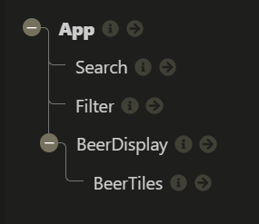
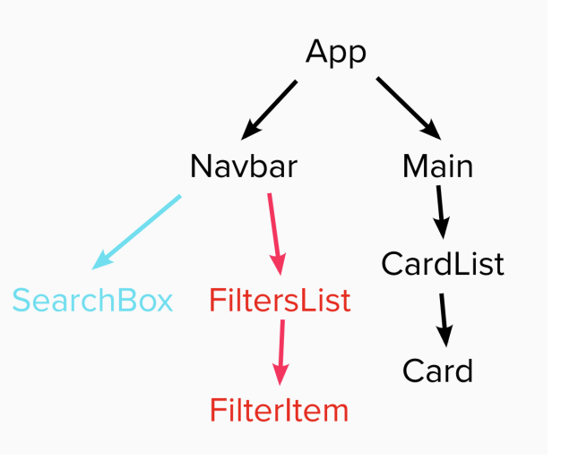

# Feedback

Right click on the file and click Open Preview or `ctrl/cmd + shift + v` to open preview

## Goals

1. Working beers web app - done
2. Practice using API and React - done
3. Application of what you're learning (React, Fetch etc.) - done

## Specification

### Start

> "All the wire frame content in black is the first part of the challenge - that is, the nav, the main section containing the beers and beer cards for each piece of data."



Your component tree looks good, it doesn't match the component tree in the brief though. The brief component tree has more components in it, this is done on purpose to give you practice making components and passing props multiple levels.



In a application this size there probably are to many components but it is good practice so why not give it a go?

Try adding in these components:

- `<Main/>`
- `<FiltersList/>`
- `<FilterItem/>`

### Extension 1

> "Once you've got the design and layout sorted to render the elements, it's time to add some search functionality. Make it so you can search the beers by their name, and the page content should update as you type each letter in the box."

The aim of this extension is to get you using functions as props. You have a function in your app `handleSearchTerm()` that you are passing down and then using in another a function inside of the `<Search/>` component.

You are close but the second function is unnecessary as you can do all of that in the function you pass in.

The component could be.

```jsx
// Search.jsx
const Search = props => {
  const { handleSearchTerm } = props;

  return <input type="text" onChange={handleSearchTerm}></input>;
};
```

The function would be.

```jsx
// App.jsx
const handleSearchTerm = event => {
  const uerInput = event.target.value.toLowerCase();
  setSearchTerm(uerInput);
};
```

This makes your `<Search/>` component more reusable you just give it a function and it uses it. It doesn't have any logic it just uses whatever you give it.

### Extension 2

> Finally attempt to make it so you can filter the content on three conditions:
>
> > - High Alcohol (ABV value greater than 6%)
> > - Classic Range (Was first brewed before 2010)
> > - High Acidity (pH lower than 4)
> > - If you can’t achieve this after a good attempt, then feel free to move on to the final extension.

Brilliant! you have got all of the filters working. You have multiple functions in the app working as state toggles which you pass into your `<Filter/>` component and use. Good use of functions as props!
The states are then passes down into you `<BeerDisplay/>` and used to filter the beers.

Its good that you got the filter working, now is the time to refactor. Your single line turnery statement isn't very readable. It is great that you got it working but Dev's are lazy they want to be able to understand something on a glance rather then go through the entire statement to see what it is doing.

```jsx
// BeerDisplay.jsx
const filteredBeers = beers.filter(beer => {
  return (
    (searchTerm ? beer.name.toLowerCase().includes(searchTerm) : true) &&
    (filterItemABV ? beer.abv > 6 : true) &&
    (filterItemClassic ? parseInt(beer.first_brewed.slice(3)) < 2010 : true) &&
    (filterItemPh ? beer.ph < 4 : true)
  );
});
```

The code below is very verbose but is more readable. Each state toggle has it its condition inside of its if block.

```jsx
// BeerDisplay.jsx
const filteredBeers = beers.filter(beer => {
  let beerHasMatched = true;

  if (searchTerm) {
    beerHasMatched = beer.name.toLowerCase().includes(searchTerm);
  }

  if (filterItemABV) {
    beerHasMatched = beerHasMatched && beer.abv > 6;
  }

  if (filterItemClassic) {
    beerHasMatched = beerHasMatched && parseInt(beer.first_brewed.slice(3)) < 2010;
  }

  if (filterItemPh) {
    beerHasMatched = beerHasMatched && beer.ph < 4;
  }

  return beerHasMatched;
});
```

### Extension 3

> Style the website however you see fit! Go wild!

It looks okay on a large monitor. You need to address the styles for other devices.

To save you time so you can focus on functionality have a read of this [CSS-Grid Article](https://css-tricks.com/look-ma-no-media-queries-responsive-layouts-using-css-grid/)

You can use it to make your cards responsive in one line.

## Overall

Very well componentised code across the board.

You have multiple functions being passed across your application. 

I feel confident with your understanding of useState, useEffect and funcs as props.

Awesome mate good going! I think this is the most polished project you have completed! I can't wait to see what you build next.

## To work on

Make the project responsive.

Update the readme.md so it is not the auto generated file.

The project is a little messy but you can easily tidy it up.

- Remove the `console.log()`
- Remove unused imports

I think if you address the above, and refactor the filter and append the search term to the request. App.jsx will be perfect.

Final notes, when you run a react app, your terminal shows you warnings. These are generally easily googleable and simple to fix and will improve code quality. So always keep one eye on your terminal while coding in react.
